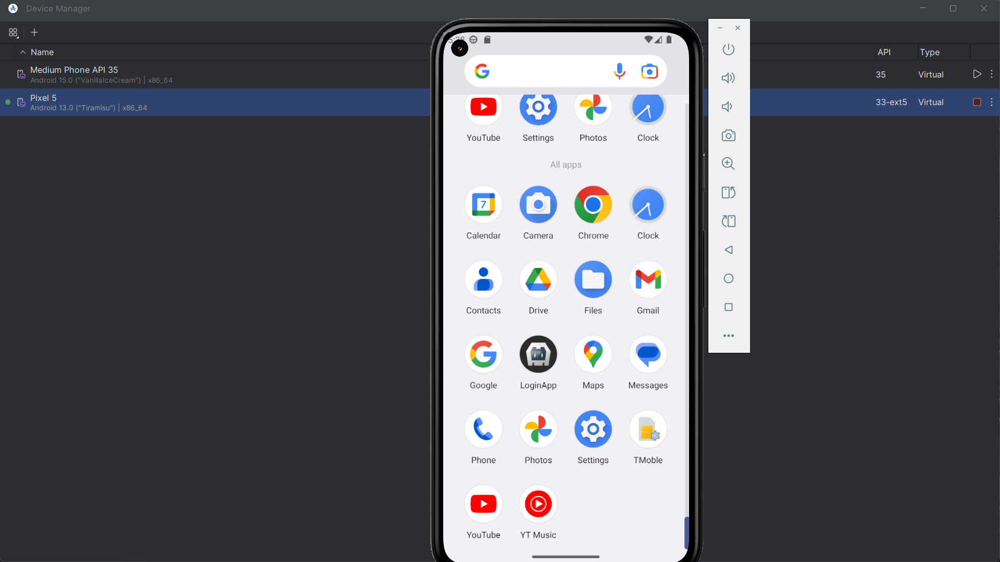
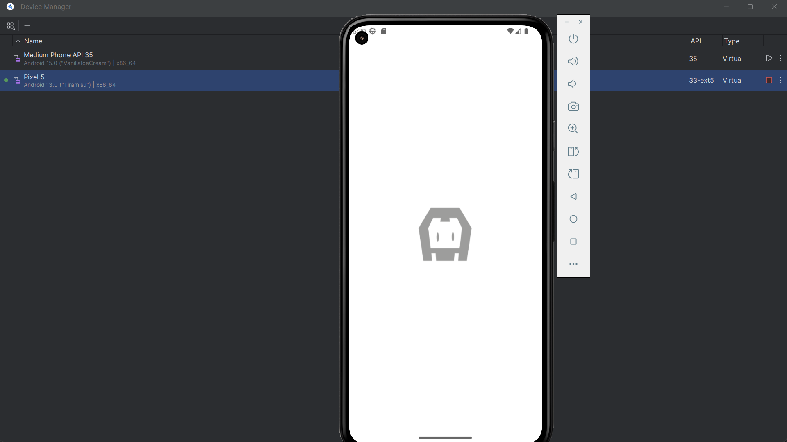
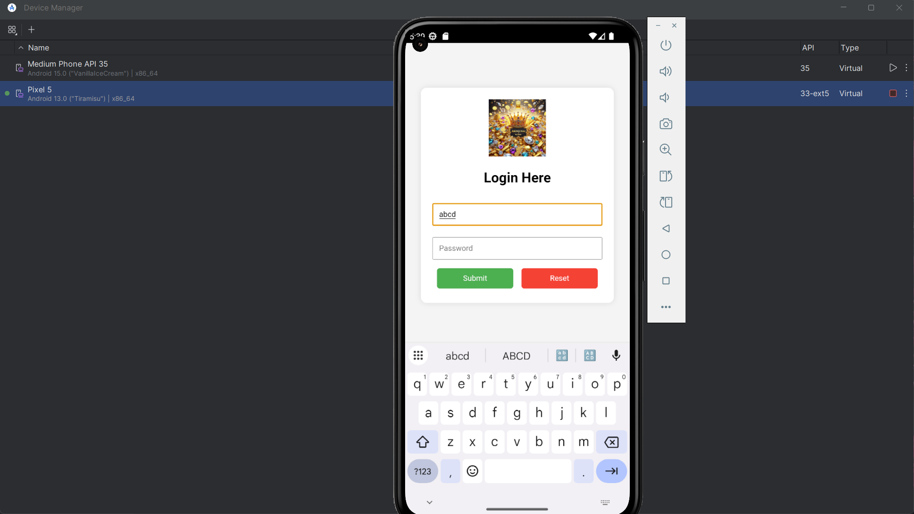
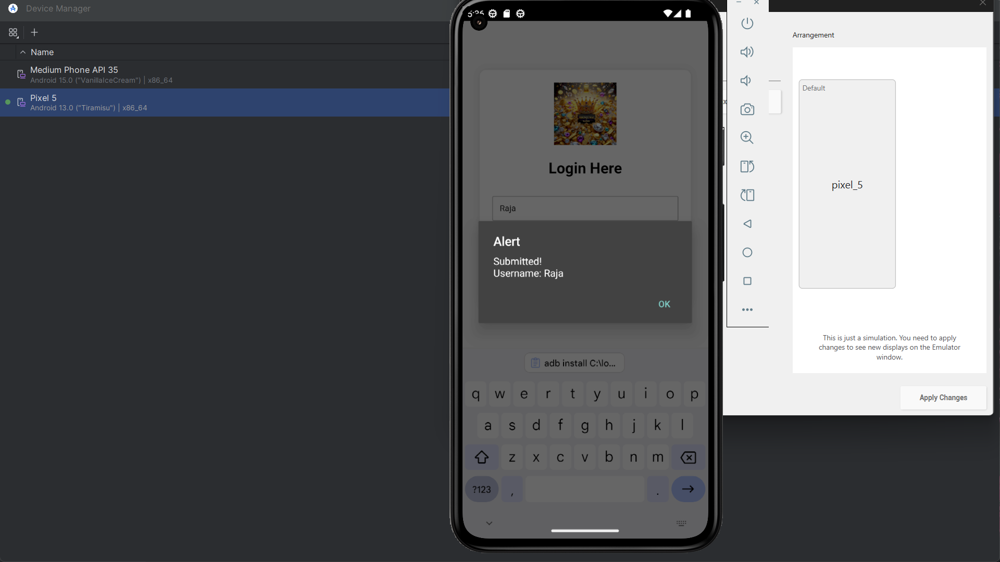

# Cordova Login App

This is a simple login app built using Apache Cordova and tested on Android Studio Emulator.

## Screenshots

### ✅ Build Success

### ✅ App Running

## How to Run

1. Clone the repo.
2. Run `cordova platform add android`
3. Run `cordova build android`
4. Install the APK via `adb install app-debug.apk`

## Author

[@rajavarshinic](https://github.com/rajavarshinic)
=======
# cordova-login-app

 https://github.com/rajavarshinic/cordova-login-app
